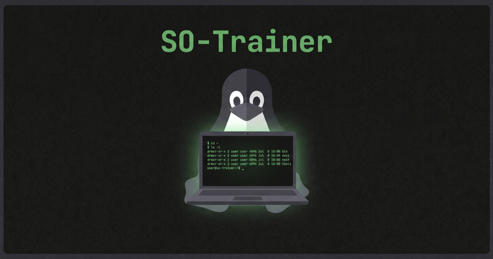

# SO Trainer — Preparazione esame Sistemi Operativi

Web app statica per prepararsi allo scritto e all’orale di Sistemi Operativi, con quiz, esercizi, simulazioni interattive degli algoritmi, simulazioni d’esame e flashcard di teoria con ripetizione dilazionata.

**Sito online**: [so-trainer.vercel.app](https://so-trainer.vercel.app)

[](https://so-trainer.vercel.app)

## Contenuto

| File | Contenuto |
|---|---|
| `img/logo.png` | Immagine di copertina del progetto, usata anche come preview del sito |
| `data/data_mcq_1..7.js` | Banca di 278 domande a risposta multipla in stile esame, con opzioni A–E, divise per argomento |
| `data/data_other.js`, `data/data_other2.js` | 45 domande da orale con risposte modello + 33 esercizi risolti passo-passo |
| `data/data_extra.js` | 20 domande da orale aggiuntive + 17 domande aperte di teoria, con risposta modello |
| `data/generators.js`, `data/generators2.js` | 25 generatori di esercizi con parametri casuali e soluzione calcolata: FAT, i-node, EAT/TLB, scheduling disco e CPU, sostituzione pagine, RAID/XOR, pipeline, semafori, aging… |
| `js/sims.js`, `js/sims2.js`, `js/sims3.js` | 14 simulazioni interattive passo-passo in SVG, ognuna con guida, controlli testuali (passo/auto, velocità, scrubber, tastiera) e — dove ha senso — confronto fra algoritmi sugli stessi dati: scheduling CPU, sostituzione pagine (con Clock animato), scheduling disco, first/best/worst/next fit, RAID/XOR, traduzione indirizzi con TLB, EAT, FAT, i-node, risoluzione di un pathname, produttore–consumatore con semafori, stati di un processo, percorso di una system call, ciclo fetch–decode–execute |
| `js/app.js` | Logica dell’app: terminale interattivo, quiz, simulazione esame con timer, flashcard con ripetizione dilazionata, revisione degli errori, storico esami, ripasso del giorno, export/import ed statistiche salvate nel browser tramite localStorage |

## Modalità

* **Home**: terminale interattivo — digita `quiz`, `./esercizi`, `orale`, `today`… oppure `help`, `ls`, `neofetch` per spostarti tra le sezioni e vedere il ripasso del giorno. In alternativa puoi cliccare una voce dell’elenco.
* **Quiz**: feedback immediato con spiegazione, filtro per argomento e modalità “solo domande sbagliate”. Puoi usare i tasti `1–5` per rispondere e `Invio` per proseguire.
* **Esercizi**: prova prima su carta, poi usa “Mostra soluzione” per controllare il procedimento. I generatori creano varianti sempre nuove.
* **Sim**: gli algoritmi del corso animati passo passo. Dal menu scegli la simulazione e si apre a tutta pagina: Gantt dello scheduling CPU, lancetta del Clock, diagramma cilindri/tempo del disco, catene FAT, cammino nell’i-node, semafori del produttore–consumatore… Cambi algoritmo e parametri, generi dati nuovi, avanzi un passo alla volta (o in automatico), confronti gli algoritmi sugli stessi dati (📊) e in fondo trovi una guida su cosa stai guardando e cosa cambia tra le varianti.
* **Simulazione esame**: N crocette + M esercizi con timer; correzione automatica delle crocette, autovalutazione degli esercizi, revisione degli errori e voto indicativo secondo le fasce del syllabus. Un esame in corso si può riprendere anche dopo aver ricaricato la pagina.
* **Orale**: flashcard di teoria (domande da orale + domande aperte, in un unico mazzo) con risposte modello e una casella per impostare la risposta scritta; la **ripetizione dilazionata** (tipo Leitner) riporta in cima le carte in scadenza.
* **Statistiche**: prestazioni per argomento, storico degli esami e andamento nel tempo, con export/import del progresso in JSON. Il ripasso del giorno (in home o con il comando `today`) propone cosa studiare adesso.

## Aggiungere domande

Aggiungi un oggetto all’array in uno dei `data/data_mcq_*.js`:

```js
{ id: "xx99", topic: "memoria",      // vedi window.TOPICS in data/data_mcq_1.js
  q: "Testo della domanda (HTML ok)",
  options: ["A", "B", "C", "D", "E"],
  correct: 2,                        // indice 0-based dell'opzione giusta
  expl: "Spiegazione mostrata dopo la risposta" },
```

Gli `id` devono essere univoci, perché le statistiche si agganciano all’id della domanda.

## Segnalazioni e contributi

Se trovi bug, errori nelle risposte, refusi, esercizi poco chiari o hai nuove domande da proporre, apri pure una **issue**.

Sono benvenute anche **pull request** per correggere contenuti, migliorare spiegazioni, aggiungere esercizi o sistemare eventuali problemi dell’interfaccia.

## Fonti

Riassunto del corso, slide del corso, Tanenbaum, fac-simile della prova scritta, testimonianze d’esame ed esercizi svolti.